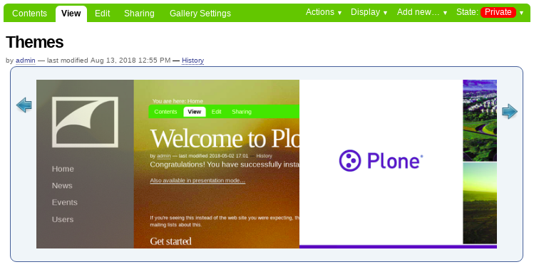
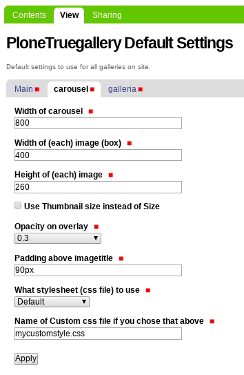

collective.ptg.carousel
=======================

This packages support a carousel display type for `collective.plonetruegallery <https://plone.org/products/plone-true-gallery>`_.

You should see:

  collective.ptg.carousel preview

Inspired by the bad weather

Features
--------

- A carousel display type for collective.plonetruegallery.

- A control panel for customization the carousel's behaviors.

Examples
--------

This add-on can be seen in action at the following site:

- http://products.medialog.no/galleries/carousel

Translations
------------

This product has been translated into

- Spanish (thanks, Leonardo Caballero)

Installation
------------

Add ``collective.ptg.carousel`` to eggs section of to your buildout into your zope client.

::

  [instance]
  ...
  eggs =
      ...
      collective.ptg.carousel

and then running "bin/buildout"

Carousel configuration
----------------------

This product use a control panel for configure the parameters for this carousel gallery.

Go to configuration area in ``Site Setup --> PloneTruegallery Default Settings`` then can 
choose the default settings to use for all galleries on site.

Or you can go to ``Your Folder / Collection --> Display --> Gallery View``, then clic to 
``Your Folder / Collection --> Gallery Settings`` tab, choose the ``carousel`` option from 
the gallery list and configure the parameters for this gallery locally.

  Carousel control panel

Contribute
----------

- Issue Tracker: http://github.com/collective/collective.ptg.carousel/issues
- Source Code: http://github.com/collective/collective.ptg.carousel
- Documentation: https://plone.org/products/plone-true-gallery/documentation
- PyPI: http://pypi.python.org/pypi/collective.ptg.carousel

License
-------

The project is licensed under the GPL.